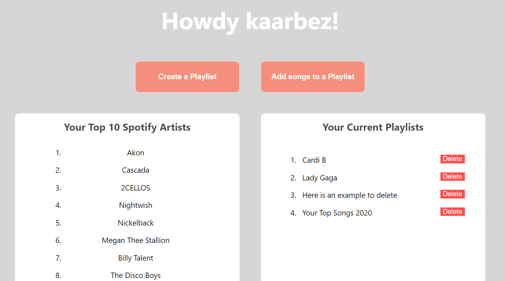

<!-- ABOUT THE PROJECT -->
## About The Project

 

A simple application built to practice integrating external APIs.

[Visit Website](https://playlist-sync-demo.herokuapp.com/)

### Built With

* [Spring Boot](https://spring.io/projects/spring-boot)
* [Next.JS](https://nextjs.org/)
* [Spotify API](https://developer.spotify.com/documentation/web-api/)

### Prerequisites

* [Java 11](https://www.oracle.com/java/technologies/javase-jdk11-downloads.html)
* [Node.js](https://nodejs.org/en/)
* [npm](https://www.npmjs.com/)

<!-- CONTACT -->
## Contact

Kayla Arbez  - kaarbez@gmail.com

Project Link: [https://github.com/KaylaArb/nwHacks-jigMap](https://github.com/KaylaArb/nwHacks-jigMap)
